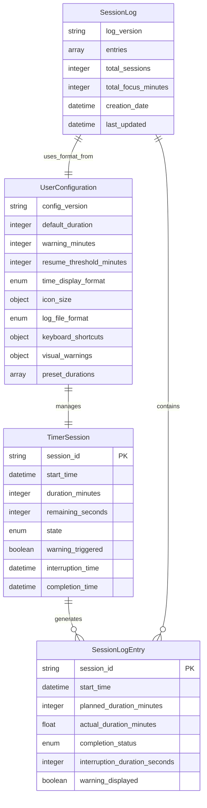

# Data Model: Lightime Pomodoro Timer

**Version**: 1.0.0
**Created**: 2025-01-21

## Core Entities

### TimerSession

Represents a single Pomodoro work session with state management.

**Attributes**:
- `session_id`: String (UUID) - Unique identifier for the session
- `start_time`: DateTime (ISO 8601) - Session start timestamp
- `duration_minutes`: Integer (1-240) - Configured session duration
- `remaining_seconds`: Integer (0-14400) - Current countdown value
- `state`: Enum (RUNNING, PAUSED, STOPPED, COMPLETED) - Session status
- `warning_triggered`: Boolean - Whether 2-minute warning has been shown
- `interruption_time`: DateTime (nullable) - System interruption timestamp
- `completion_time`: DateTime (nullable) - Session completion timestamp

**State Transitions**:
```
STOPPED → RUNNING (start_timer)
RUNNING → PAUSED (pause_timer)
PAUSED → RUNNING (resume_timer)
RUNNING → COMPLETED (timer reaches zero)
RUNNING → STOPPED (manual_stop)
PAUSED → STOPPED (manual_stop)
```

**Validation Rules**:
- `duration_minutes` must be between 1 and 240
- `remaining_seconds` must be between 0 and duration_minutes * 60
- `start_time` cannot be in the future
- Only one RUNNING session allowed at any time

### UserConfiguration

Manages user preferences and application settings.

**Attributes**:
- `config_version`: String - Configuration schema version
- `default_duration`: Integer (25) - Default session duration in minutes
- `warning_minutes`: Integer (2) - Minutes before session end to show warning
- `resume_threshold_minutes`: Integer (5) - Max interruption duration for resume
- `time_display_format`: Enum (MINUTES_SECONDS, MINUTES_ONLY) - Time display format
- `icon_size`: Object (width: 64, height: 64) - Timer icon dimensions
- `log_file_format`: Enum (CSV, JSON, PLAIN_TEXT) - Logging output format
- `keyboard_shortcuts`: Object - Global hotkey mappings
- `visual_warnings`: Object - Warning behavior settings
- `preset_durations`: Array[Integer] - Quick access duration options

**Schema Structure**:
```yaml
config_version: "1.0.0"
default_duration: 25
warning_minutes: 2
resume_threshold_minutes: 5
time_display_format: "MINUTES_SECONDS"
icon_size:
  width: 64
  height: 64
log_file_format: "CSV"
keyboard_shortcuts:
  start_25min: "Ctrl+Alt+P"
  start_custom: "Ctrl+Alt+O"
visual_warnings:
  mode: "FLASH"  # FLASH, RESIZE, COLOR_CHANGE
  flash_interval_ms: 500
  resize_factor: 1.2
preset_durations: [15, 25, 45, 60]
```

**Default Values**:
- Created automatically when config file doesn't exist
- Migrates older config versions automatically
- Validates all user inputs against schema

### SessionLog

Manages productivity data logging and analytics.

**Attributes**:
- `log_version`: String - Log format version
- `entries`: Array[SessionLogEntry] - Historical session data
- `total_sessions`: Integer - Count of all completed sessions
- `total_focus_minutes`: Integer - Cumulative focus time
- `creation_date`: DateTime - Log file creation timestamp
- `last_updated`: DateTime - Last log update timestamp

### SessionLogEntry

Individual session record for analytics.

**Attributes**:
- `session_id`: String - References TimerSession.session_id
- `start_time`: DateTime (ISO 8601) - Session start
- `planned_duration_minutes`: Integer - Intended session length
- `actual_duration_minutes`: Float - Actual completed time (may differ due to interruptions)
- `completion_status`: Enum (COMPLETED, MANUAL_STOP, INTERRUPTION) - How session ended
- `interruption_duration_seconds`: Integer (0) - Total pause time if applicable
- `warning_displayed`: Boolean - Whether 2-minute warning was shown

## Data Storage

### Configuration File

**Location**: `~/.config/lightime/config.yaml`
**Format**: YAML with schema validation
**Permissions**: 600 (user read/write only)
**Backup**: Automatic backup before major changes

### Session Log Files

**Primary Location**: `~/.local/share/lightime/sessions.csv`
**Format Options**:
- **CSV**: Comma-separated with headers for Excel/Google Sheets import
- **JSON**: Structured format for advanced analysis tools
- **Plain Text**: Human-readable format for manual inspection

**CSV Structure**:
```csv
session_id,start_time,planned_duration_minutes,actual_duration_minutes,completion_status,interruption_duration_seconds,warning_displayed
550e8400-e29b-41d4-a716-446655440000,2025-01-21T09:00:00Z,25,24.5,COMPLETED,0,true
```

**JSON Structure**:
```json
{
  "log_version": "1.0.0",
  "entries": [
    {
      "session_id": "550e8400-e29b-41d4-a716-446655440000",
      "start_time": "2025-01-21T09:00:00Z",
      "planned_duration_minutes": 25,
      "actual_duration_minutes": 24.5,
      "completion_status": "COMPLETED",
      "interruption_duration_seconds": 0,
      "warning_displayed": true
    }
  ]
}
```

## State Management

### Application State

**Global State Variables**:
- `current_session`: TimerSession (nullable) - Active session
- `gui_state`: Enum (ACTIVE, HIDDEN, MINIMIZED) - Window visibility
- `system_tray_active`: Boolean - Tray icon status
- `config_file_path`: String - Configuration file location
- `log_file_path`: String - Active log file location

**Persistence**:
- Configuration changes saved immediately
- Session state saved to temporary file during interruptions
- Log entries written immediately upon session completion

### Error Handling

**Validation Errors**:
- Invalid timer duration → User notification with valid range
- Corrupted config file → Fallback to defaults, user notification
- Log file write failure → Cache entries locally, retry later

**Runtime Errors**:
- Screen lock failure → User notification, continue timer
- System tray initialization failure → Continue with window only
- Keyboard shortcut conflict → Alternative shortcut suggestion

## Data Relationships



## Performance Considerations

### Memory Usage
- Single TimerSession instance in memory
- Configuration loaded on startup, cached
- Log entries written immediately, not held in memory

### File I/O
- Configuration: Read once, written on changes
- Session logs: Append-only for performance
- Temporary session state: Small JSON file for recovery

### Scalability
- Log files rotated monthly to prevent unlimited growth
- Old logs archived automatically
- Configuration migration handled automatically

This data model provides a robust foundation for implementing all Lightime features while maintaining data integrity, performance, and user privacy.